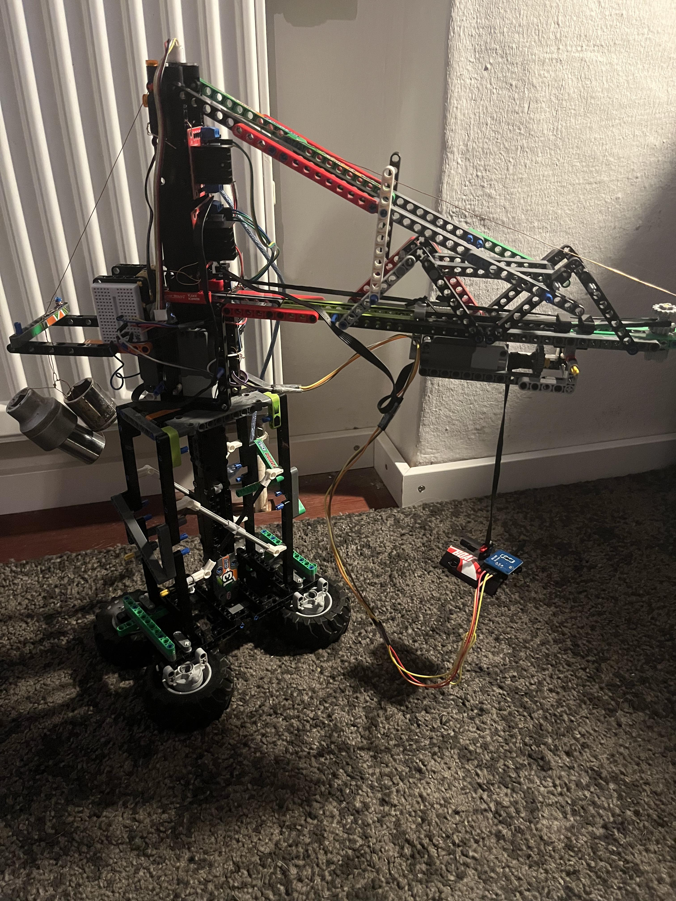

<div align="center">

  

  # Magnetkran
  ### Schulinternes Entwicklungsprojekt • Hardware & Steuerung
  
  
  
  
  
  **Autor:** Paul Dreißig

</div>

---

## 🏗️ Dokumentation & Projektstruktur

Das ist das zentrale Repository für das **Magnetkran-Projekt**. Hier findest du alle Konstruktionspläne, Schaltpläne, Quellcodes und Präsentationen:

<details>
<summary><b>📄 Dokumente & Präsentationen</b></summary>
<br>

* [📄 Projektbeschreibung](./docs/projekt-beschreibung.odt)
* [📓 Logbuch (PDF)](./docs/logbuch.pdf)
* [📊 Materialliste & Kosten](./docs/materialliste-und-kosten.ods)
* [📝 Handout zur Präsentation](./docs/presentation/handout.odt)

Präsentation (Pitch)
* [📽️ Pitch-Präsentation (PDF)](./docs/presentation/pitch-präsentation.pdf)
* [📽️ Pitch-Präsentation (PPTX)](./docs/presentation/pitch-präsentation.pptx)

</details>

<details>
<summary><b>⚡ Elektronik & Schaltpläne</b></summary>
<br>

* [📄 Schaltplan (Farbe)](./electronics/schaltplan.pdf)
* [📄 Schaltplan (Schwarz/Weiß)](./electronics/schaltplan-b%26w.pdf)
* [🎛️ KiCad Projektordner](./electronics/kicad-magnetkran/)

</details>

<details>
<summary><b>💻 Firmware & Steuerung</b></summary>

* [💻 Firmware Quellcode](./firmware/kran-oben-magnetkran/)

</details>

<details>
<summary><b>📐 Mechanik & Physik</b></summary>

* [📐 Kräfteverteilung am Ausleger (PDF)](./mechanics/force-distribution-on-crane.pdf)

</details>

<details>
<summary><b>🖼️ Fotodokumentation & Prototypen</b></summary>

* [📷 Bauphasen & Bildeindrücke](./img/)
* [✂️ Papiermodell](./img/papiermodell-magnetkran/)

</details>

---

## 🛠️ Features & Technische Details

* **Motor- & Magnetansteuerung:** Eigenbau-H-Brücken zur präzisen Ansteuerung der Motoren sowie des Elektromagneten.
* **Signalverarbeitung:** IR-Empfänger zur drahtlosen Steuerung des Krans.
* **Custom PCB:** Hardware-Entwurf und Layout erstellt mit KiCad.
* **Mechanische Analyse:** Vektoriell berechnete Kräfteverteilung am Kranausleger.

---

## 📥 Projekt Herunterladen

Git Clone (Repository klonen)

```bash
cd Downloads
git clone [https://github.com/B13M4RK/Magnetkran.git](https://github.com/B13M4RK/Magnetkran.git)
